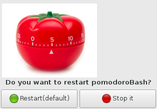

Don't make any excuse anymore to not use the [Pomodoro Technique](https://en.wikipedia.org/wiki/Pomodoro_Technique)!

###Info

Boilerplate implementation of the pomodoro technique in bash script.

It works with a client/server architecture.

Implemented with FSM (Finite State Machine), some mutex (flock) and really simple.

The typical workflow is start the daemon once log in (systemd,openbox autostart ...) and 
then using a very simple trayicon app work with it (not a must)

Just a hack day.

###Dependencies

1. flock
2. inotify-tools 
3. yad 

Great tools all!

###Why yet another pomodoro app?

Emmm...for fun? :o:

###Screenshots

Relax time:

Back to work:

###TODO

- [x] Make the gtk trayicon app (yad rulez)
- [x] Only one daemon instance
- [ ] Taskwarrior integration (WIP)
- [ ] Unit testing (bats)
